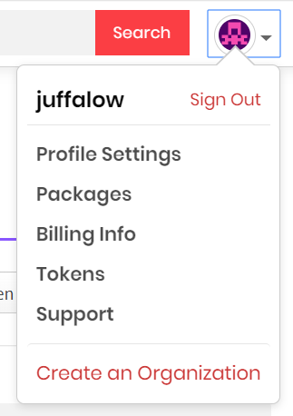
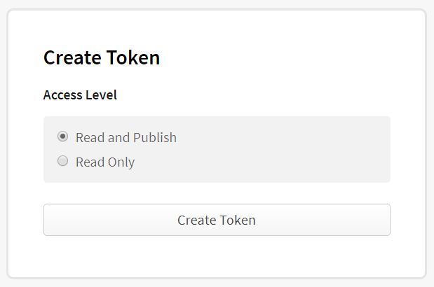
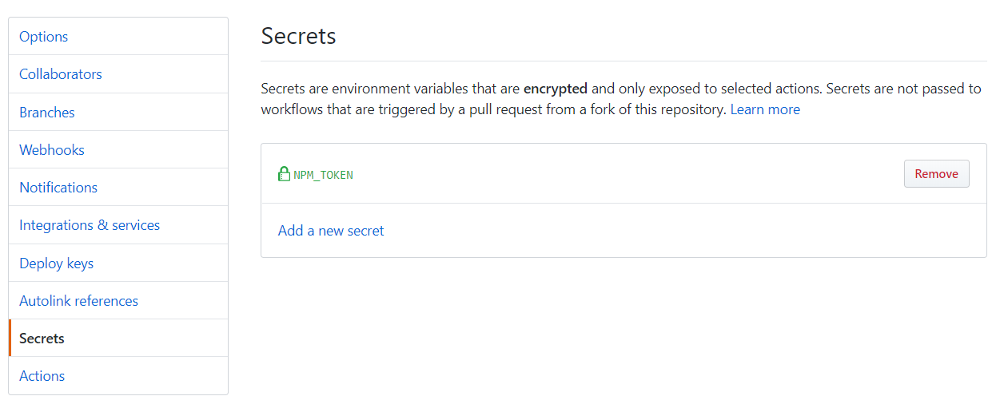

On couple of my projects, I started using [GitHub Actions](https://github.com/features/actions).

===

#### Workflow

Let's create a basic script, to publish package to [npm](https://www.npmjs.com/) when a new release is created. I named the file *publish.yml* and the workflow name is also *publish*. It should run only when a release is published. (You can create just pre-release or draft, where you don't want to run this script)

```yml
name: Publish

on:
  release:
    types: [published]
```

Job steps are simple. We need to install dependencies, build the project and publish it. Start with the easy one - install and build:

```yml
jobs:
  build:

    runs-on: ubuntu-latest
    
    steps:
    - uses: actions/checkout@v1
    - name: Install dependencies
      run: yarn install
    - name: Build
      run: yarn run build
```

This will make the project ready for upload. To be able to publish it, you need to login into npm, or 
create there a token, which you can use for this purpose. Go to npm, log in, and create new token:

 

Copy the value and add it as a *Secret* in GitHub project settings.



npm and yarn will use this token, if it is stored in *.npmrc* file in your home directory. So the next step is to create such a file.

```yml
    - name: Create .npmrc
      run: echo "//registry.npmjs.org/:_authToken=$NODE_AUTH_TOKEN" >> ~/.npmrc
      env:
        NODE_AUTH_TOKEN: ${{ secrets.NPM_TOKEN }}
```

The last step is to upload it to npm. Version, which you choosed during creating the release is available in `$GITHUB_REF` variable as a reference to the tag (example: refs/tags/1.2.3). If you want to pass it to the publish command, you need to remove this prefix.

Btw, if you use `yarn publish`, it will upload files and then create a commit. The problem I encountered is, that git needs to have user name and email to be able to commit. It is not a problem to set it, if you want, or just disable this feature by adding a `--no-git-tag-version` argument.

```yml
    - name: Publish
      run: yarn publish --new-version ${GITHUB_REF#"refs/tags/"} --no-git-tag-version
```

#### Final script

```yml
name: Publish

on:
  release:
    types: [published]

jobs:
  build:

    runs-on: ubuntu-latest
    
    steps:
    - uses: actions/checkout@v1
    - name: Install dependencies
      run: yarn install
    - name: Build
      run: yarn run build
    - name: Create .npmrc
      run: echo "//registry.npmjs.org/:_authToken=$NODE_AUTH_TOKEN" >> ~/.npmrc
      env:
        NODE_AUTH_TOKEN: ${{ secrets.NPM_TOKEN }}
    - name: Publish
      run: yarn publish --new-version ${GITHUB_REF#"refs/tags/"} --no-git-tag-version
```
