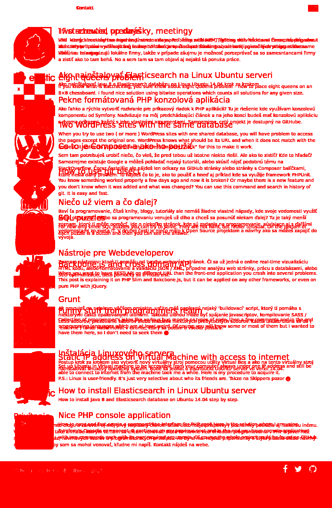

Maybe you know the situation when you deploy some page, check it fastly and go away from the office feeling good about your job done. Then a colleague calls you and you hear “What did you do? It is not working!”.

===

## Regression test with screen difference

The same thing happend to me. I deployed a project, looked at it and everything seemed to be ok. But a few minutes ( maybe hour+ ) later a colleague called me, that some images are missing on the page. So I went back to the office and fixed it. Fortunatelly, it wasn’t any critical error or a page with lot of traffic.

Later I was thinking how to prevent from such situations. I remembered I saw a video where somebody made a mistake and added a pony on a page and deployed it.

#### The Secret to Safe Continuous Deployment

Here is the video, where they suggest to take a screenshot before deploy and after deploy. Then a visual diff is created and calculated and you can see what changed.

<div class="row">
  <div class="col-lg-6 col-lg-offset-3 col-md-6 col-md-offset-6 col-xs-12">
    <div class="embed-responsive embed-responsive-16by9">
      <iframe class="embed-responsive-item" src="https://www.youtube.com/embed/UMnZiTL0tUc"></iframe>
    </div>
  </div>
</div>

#### Install tools

You need to install a few tools which are used later. First is **PhantomJS**, which is *headless WebKit with a JavaScript API*. You can download it [here](http://phantomjs.org/download.html) but it is available as [npm package](https://www.npmjs.com/package/phantomjs) too.

<div class="alert alert-info" role="alert">I assume you know about <a herf="https://nodejs.org/en/">Node.js</a> and <a href="https://www.npmjs.com/">NPM</a> and how to use it.</div>

```
$ sudo npm install -g phantomjs
```

Now, you should have the <kbd>$ phantomjs</kbd> command available in your terminal. Then you need two other tools, **image-diff** which depends on **ImageMagick**.

```
$ sudo apt-get install imagemagick

$ sudo npm install -g image-diff
```

#### Take a screenshot of a website

And here is the magic part. Create a JavaScript file, for example *screen1.js* and paste there the code below :

```
var page = require('webpage').create();
page.viewportSize = { width: 1024, height: 768 };
page.open('https://www.juffalow.com/', function() {
  page.render('juffalow.png');
  phantom.exit();
});
```

Run this code with command <kbd>$ phantomjs screen1.js</kbd> and a new *juffalow.png* file will be created in your current directory. Then write another JavaScript, *screen2.js* :

```
var page = require('webpage').create();
page.viewportSize = { width: 1024, height: 768 };
page.open('https://en.juffalow.com/', function() {
  page.render('en-juffalow.png');
  phantom.exit();
});
```

Thisone will load english part of this site and saves it to *en-juffalow.png*. Here are the screenshots at the time I was writing this :

 

#### Calculate the diff

When you have both screenshots ready, you can go to the last step. Run the following command where the first two arguments are the names of the screenshots and the third is name of diff image which it creates :

```
$ image-diff juffalow.png en-juffalow.png diff.png

$ echo $? // prints 1
```

The images don’t match, so it prints 1 and you can see new image, where the different pixels are highlighted with red color.



The same can be achieved with JavaScript. The advantage is it prints percentage difference between the images. If you want to try it, you have to install image-diff locally as node module. ( Little “hack” : link the global package with <kbd>$ npm link image-diff</kbd> ). And here is *diff.js* file :

```
var imageDiff = require('image-diff');
imageDiff.getFullResult({
    actualImage: 'en-juffalow.png',
    expectedImage: 'juffalow.png',
    diffImage: 'diff.png',
}, function (err, result) {
    console.log(result); // prints { total: 19885.8, percentage: 0.303438 }
});
```

This can be run with just node : <kbd>$ node diff.js</kbd>.

## Conclusion

You can do a lot more with these tools. For example include jQuery and fire some button click function and test if it does what it should, etc. Now, when I add it before and after deploy process, I can only look what changed and see if it is what I wanted to change. Or, in the worse case, see what’s got broken.

#### References

Phantom JS on [GitHub](https://github.com/ariya/phantomjs) and its official [page](http://phantomjs.org/).

The [image-diff](https://github.com/uber/image-diff) module.
