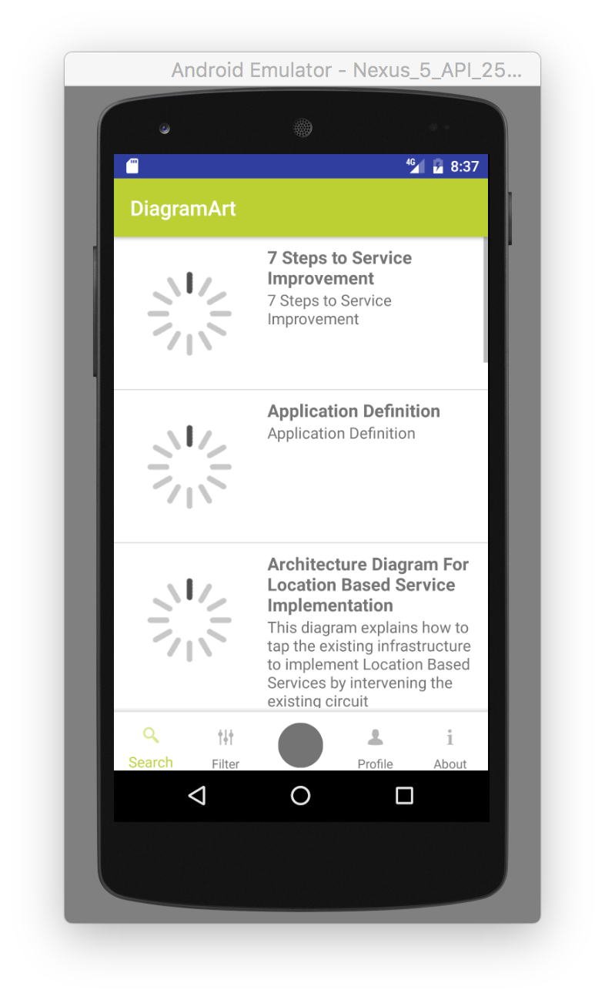
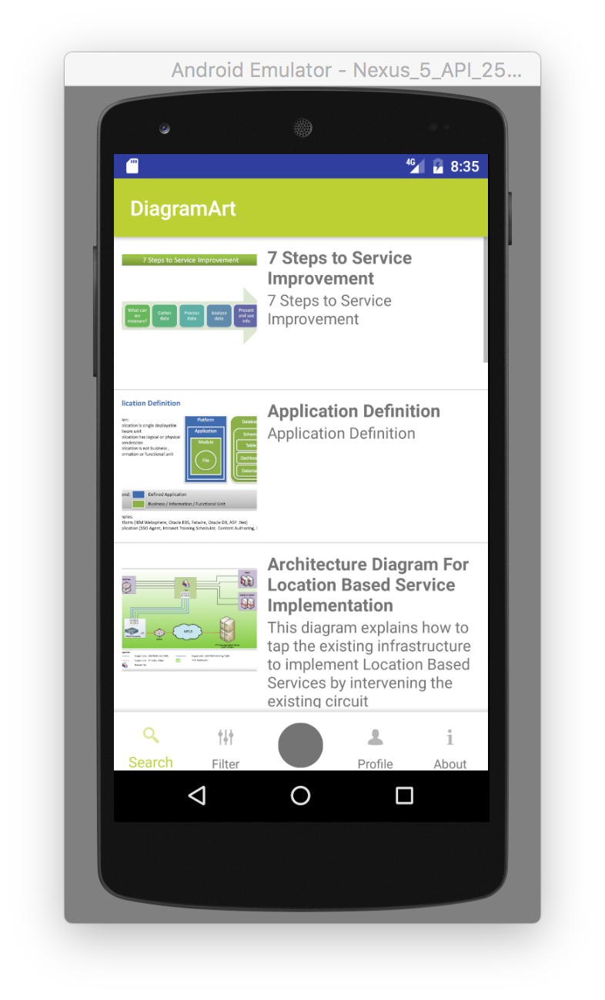

I am working for a Start Up project – [DiagramArt](https://diagramart.com/), where we needed to create Android application which : load list of diagrams from API, show these diagrams to the user and some other stuff of course. The list consists from a preview picture, diagram’s title and its description. There is no problem to load and show these data, the problem was in the preview picture.

===

When you want to show these information in some list, you have to create your own `Adapter` and override `getView` method. Then a strange bug occured : the preview pictures were changing “randomly”. Why? Because of memory saving, the system creates only a few rows and when you scroll, the list calls `getView` on the visible rows. That means, the rows are always the same, only the content are changing. So whenever you scroll down and up, it was loading the pictures again and again.

## Fresco

I wrote about my problem to my friends on skype and they recommended me [Fresco](http://frescolib.org/) library from Facebook. It solves these problems for you. Loads the image from the internet and cache it.

#### Install

Open *build.gradle ( Module: app )* file and add there the library :

```
dependencies {
    ...
    compile 'com.facebook.fresco:fresco:0.14.1'
    ...
}
```

When you save the file, you have to sync your project!

#### Initialize

You need to initialize *Fresco* class. This should be done only once. For this purpose create new class `MyApplication` which extends from `Application`.

```
package com.diagramart.diagramart;

import android.app.Application;
import com.facebook.drawee.backends.pipeline.Fresco;

public class MyApplicaiton extends Application {
    @Override
    public void onCreate() {
        super.onCreate();
        Fresco.initialize(this);
    }
}
```

#### Android Manifest

Edit the project’s *AndroidManifest.xml* file, add there permissions for internet ( because the image has to be downloaded ) and add `android:name` attribute to `application` element :

```
<?xml version="1.0" encoding="utf-8"?>
<manifest
    ... >

    ...
    <uses-permission android:name="android.permission.INTERNET" />
    ...

    <application
        android:name=".MyApplicaiton"
        ... >
    </application>
</manifest>
```

#### Layout

As I mentioned on the begining, there is a list with rows, where every row has a preview picture, title and description part. The layout of the search screen has only the list component :

```
<FrameLayout xmlns:android="http://schemas.android.com/apk/res/android"
    xmlns:tools="http://schemas.android.com/tools"
    android:layout_width="match_parent"
    android:layout_height="match_parent"
    tools:context="com.diagramart.diagramart.SearchFragment">

    <ListView
        android:id="@+id/search_list"
        android:layout_width="fill_parent"
        android:layout_height="fill_parent"
        android:divider="@color/list_divider"
        android:dividerHeight="1dp"
        android:listSelector="@drawable/list_row_selector"
        android:layout_alignParentTop="true"
        android:layout_alignParentLeft="true"
        android:layout_alignParentStart="true" />

</FrameLayout>
```

Now, we need to create layout for the row. Create *search_list_row.xml* file in layout directory :

```
<?xml version="1.0" encoding="utf-8"?>
<RelativeLayout xmlns:android="http://schemas.android.com/apk/res/android"
    xmlns:fresco="http://schemas.android.com/apk/res-auto"
    android:layout_width="fill_parent"
    android:layout_height="wrap_content"
    android:background="@drawable/list_row_selector"
    android:padding="8dp">

    <com.facebook.drawee.view.SimpleDraweeView
        android:id="@+id/search_thumbnail"
        android:layout_width="130dp"
        android:layout_height="130dp"
        fresco:placeholderImage="@drawable/loader" />

    <!-- Diagram Title -->
    <TextView
        android:id="@+id/search_title"
        android:layout_width="wrap_content"
        android:layout_height="wrap_content"
        android:layout_alignTop="@+id/search_thumbnail"
        android:layout_toRightOf="@+id/search_thumbnail"
        android:layout_marginLeft="10dip"
        android:textSize="@dimen/title"
        android:textStyle="bold" />

    <!-- Diagram description -->
    <TextView
        android:id="@+id/search_description"
        android:layout_width="wrap_content"
        android:layout_height="wrap_content"
        android:layout_below="@+id/search_title"
        android:layout_toRightOf="@+id/search_thumbnail"
        android:layout_marginLeft="10dip"
        android:textSize="@dimen/description" />

</RelativeLayout>
```

#### Custom Adapter

Whenever you want to customize the list view, you need to create your own `Adapter` :

```
package com.diagramart.diagramart.helpers;

import android.app.Activity;
import android.content.Context;
import android.net.Uri;
import android.util.Log;
import android.view.LayoutInflater;
import android.view.View;
import android.view.ViewGroup;
import android.widget.BaseAdapter;
import android.widget.TextView;

import com.diagramart.diagramart.R;
import com.facebook.drawee.view.SimpleDraweeView;

import java.util.ArrayList;

public class LazyAdapter extends BaseAdapter {
    private String TAG = LazyAdapter.class.getSimpleName();

    private Activity activity;
    private ArrayList<Diagram> data;
    private static LayoutInflater inflater=null;

    public LazyAdapter(Activity a, ArrayList<Diagram> d) {
        activity = a;
        data = d;
        inflater = (LayoutInflater)activity.getSystemService(Context.LAYOUT_INFLATER_SERVICE);
    }

    public int getCount() {
        return data.size();
    }

    public Object getItem(int position) {
        return position;
    }

    public long getItemId(int position) {
        return position;
    }

    public View getView(int position, View convertView, ViewGroup parent) {
        Log.d(TAG, "getView()");

        View vi = convertView;
        if(convertView == null) {
            vi = inflater.inflate(R.layout.search_list_row, null);
        }

        TextView title = (TextView) vi.findViewById(R.id.search_title);
        TextView description = (TextView) vi.findViewById(R.id.search_description);

        Diagram diagram = data.get(position);

        title.setText(diagram.getName());
        description.setText(diagram.getDescription());

        Uri uri = Uri.parse(diagram.getPreviewPictureURL());
        SimpleDraweeView draweeView = (SimpleDraweeView) vi.findViewById(R.id.search_thumbnail);
        draweeView.setImageURI(uri);

        return vi;
    }
}
```

The important part here is the `getView` method. It set all values for each row that we want to display. The `SimpleDraweeView` is the image class from *Fresco* library. You set the image URL and it downloads it and save it to cache. So whenever you want to display the same picture, it will be loaded from the cache insted of downloading it again.

#### Activity / fragment

```
public class SearchFragment extends Fragment {
    ...
    @Override
    public View onCreateView(LayoutInflater inflater, ViewGroup container, Bundle savedInstanceState) {
        View v = inflater.inflate(R.layout.fragment_search, container, false);

        this.list = (ListView) v.findViewById(R.id.search_list);
        this.adapter = new LazyAdapter(getActivity(), this.diagrams);
        this.list.setAdapter(adapter);

        return v;
    }
    ...
    private class SearchDiagram extends AsyncTask {
        @Override
        protected Void doInBackground(String... arg0) {
            try {
                // load diagrams from API

                // parse everything and save result in diagrams variable

                diagrams.addAll(diagrams);

                getActivity().runOnUiThread(new Runnable() {
                    @Override
                    public void run() {
                        adapter.notifyDataSetChanged();
                    }
                });
            } catch(Exception e) {
                // error
            }

            return null;
        }
    }
}
```

#### The result

Here are few screenshots how does this look like ( these screenshots were made during alfa version development ) :



## Conclusion

Short intro for how to use Fresco ( or better, how I used it in my side project ) reaches its end. If you have any problem or you have some recommendations, please, leave here a comment.

#### References

[GitHub – Fresco](https://github.com/facebook/fresco)

[Android Open Source – Android-Display-Images-from-SD-Card-Tutorial Lazy Adapter](http://www.java2s.com/Open-Source/Android_Free_Code/Image/display/com_androidbegin_sdimagetutorialLazyAdapter_java.htm)
