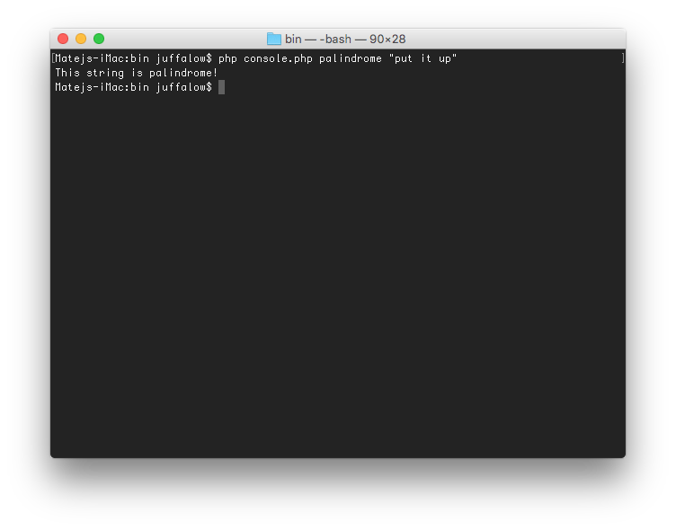
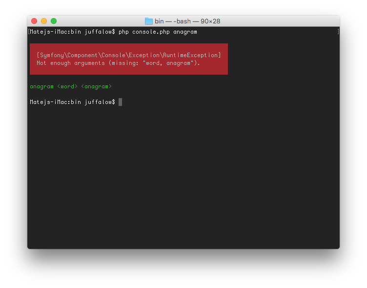

Nikedy potrebuješ vytvoriť konzolové rozhranie pre tvoju aplikáciiu a keď ho chceš mať pekne naformátované, farebné, prípadne tam má byť nejaká tá tabulka, tak to nie je ľahké spraviť. Môžeš pozrieť na internet a zistiť, ako niečo také spraviť, no buď pripravený, že písania bude dosť a stále to nebude ono.

===

## Symfony console

S komponentou **Symfony console** urobíš všetko na čo si zvyknutý pri práci s konzolou. Napríklad tabulky, loader ( progress bar ), otázky, dialógy, atď. A pomôže ti s veľa daľšími bežnými vecami. Je jednoduche pridať povinný alebo nepovinný argument, vytvoriť help alebo pridať ďaľší príkaz.

#### Nový problém – *Anagram*

Nadviažem na môj predchádzajúci článok [Čo to je Composer]. Ako príklad tam je projekt, kde musíš zistiť, či zadaný reťazec je palindróm alebo nie. Teraz to rozšírime o ďaľší problém.

> Anagram (z gr. anagrafein – prepísať) alebo prešmyčka je slovo, ktoré vznikne zmenou poradia písmen v inom slove.
> - Wikipedia

Riešenie zahŕňa CLI, pomocou ktorého sa bude dať lahko testovať, či sú slová anagramy alebo palindrómy. Samozrejme musí byť dostupný help pre každý príkaz a nápoveda ako ho použiť.

#### Krok za krokom

Projekt si môžeš stiahnut z [GitHub commitu](https://github.com/juffalow/ComposerExample/tree/431ec3f4464ff5e966b22e4b543fa6556b4af1bc) alebo si prejsť spomenutý článok a vytvoriť si ho sám. Mal by si skončiť s takouto adresárovou štruktúrou :

```
src
    Palindrome.php
tests
    PalindromeTest.php
vendor
    …
composer.json
composer.lock
```

Opäť začneme testami. Takže vytvor súbor *AnagramTest.php* v adresári src. Názov triedy bude `Anagram` a metóda môže byť `isAnagram`. Testovať treba nejaký anagram a iný reťazec, ktorý nie je anagram.

```
use src\Anagram;

class AnagramTest extends PHPUnit_Framework_TestCase {

    private $anagram;

    public function setUp() {
        $this->anagram = new Anagram();
    }

    public function testSuitableString() {
        $this->assertTrue($this->anagram->isAnagram('silent', 'listen'));
        $this->assertTrue($this->anagram->isAnagram('I am Lord Voldemort', 'Tom Marvolo Riddle'));
    }

    public function testNotSuitableString() {
        $this->assertFalse($this->anagram->isAnagram('anagram', 'palindrome'));
    }
}
```

#### Anagram

Je veľa spôsobov ako zistiť či sa jedná o anagram. Jeden z nich je zoradiť oba reťazce podla abecedy a porovnať ich. Ak sa rovnajú, tvoria anagram. Pre istotu možeš vymazať medzery a zmeniť pismená na malé.

```
namespace src;

class Anagram {
    /**
     *
     * @param string $str1
     * @param string $str2
     * @return boolean
     */
    public function isAnagram( $str1, $str2 ) {
        return $this->sortString($this->sanitizeString($str1)) === $this->sortString($this->sanitizeString($str2));
    }

    /**
     * Odstrani vsetky medzery a zmeni pismena na male
     * @param string $str
     * @return string
     */
    private function sanitizeString( $str ) {
        return \strtolower(\str_replace(' ', '', $str));
    }

    /**
     * Zoradi pismena v retazci podla abecedy
     * @param string $str
     * @return string
     */
    private function sortString( $str ) {
        $chars = str_split($str);
        sort($chars);
        return implode('', $chars);
    }
}
```

pusti testy <kbd>phpunit --bootstrap ./vendor/autoload.php ./tests/AnagramTest.php</kbd>. Výsledok by mal byť `OK (2 tests, 3 assertions)` a ty smieš pokračovať vo vytváraní rozhrania pre príkazový riadok.

#### Vytváranie rozhrania pre príkazový riadok

Najskôr musíš nainštalovať Symfony Console balíček. Otvor si súbor *composer.json* a pridaj novú závislosť do kľúča `require` a spusti príkaz <kbd>composer install</kbd>.

```
    ...
    "require": {
        "phpunit/phpunit": "^4.6.0",
        "symfony/console": "~2.6"
    },
    ...
```

Teraz, keď máš všetko potrebné, vytvor adresár *bin* v koreňovom adresári. Tam bude umiestnená celá konzolová aplikácia. Na konci budeš spúšťať iba hlavný skript, ktorý berie ako argumenty názov príkazu a jeho argumenty.

Aby v tom bol poriadok, štruktúra bude nasledovná :

```
bin
    command
        AnagramCommand.php
        PalindromeCommand.php
    console.php
src
    …
tests
    …
vendor
    …
composer.json
composer.lock
```

Pretože bola vytvorená nová zložka ( nový namespace, ktorý treba namapovať ) musíš túto zložku zapísať do `autoload` a znovu vygenerovať *autoload.php* pomocou príkazu <kbd>composer dump-autoload</kbd>.

```
    ...
    "autoload": {
        "psr-4": {
            "src\\" : "src",
            "bin\\": "bin"
        }
    }
    ...
```

#### AnagramCommand.php

Je čas vytvoriť prvý príkaz. Ten sa vytvára dedením od triedy `Command` z `Symfony\Component\Console\Command`. Potom treba nastaviť základné informácie ako napr. meno, popis, zoznam argumentov, atď. Na to je určená metóda, ktorú je nutné prepísať ( overridnuť ) – `protected function configure()`.

```
namespace bin\command;

use Symfony\Component\Console\Command\Command;
class AnagramCommand extends Command {
    protected function configure() {
        $this
            ->setName('anagram')
            ->setDescription('Skontroluje, či sú dva reťazce anagram.')
            ->addArgument('word', InputArgument::REQUIRED, 'Hlavné slovo')
            ->addArgument('anagram', InputArgument::REQUIRED, 'Slovo, ktoré ma byť skontrolované, či tvorí anagram s hlavným slovom')
            ->setHelp("Anagram alebo prešmyčka je slovo, ktoré vznikne zmenou poradia písmen v inom slove.\nOdkaz : https://sk.wikipedia.org/wiki/Anagram")
        ;
    }
}
```

Časť `setName` je myslím jasná. Popis ( *setDescription* ) je krátky text zobrazený v zozname dostupných príkazov ako nápoveda narozdiel od pomocného textu ( *setHelp* ), ktorý je zobrazený na vyžiadanie zadaním `--help`. Príkaz berie dve slová / reťazce ako argument aby vyhodnotil, či sa jedná o anagram alebo nie. Nazval som ich word a anagram, nastavil ako povinné s popisom ‘Hlavné slovo’ a ‘Slovo, ktoré ma byť skontrolované, či tvorí anagram s hlavným slovom’.

Metóda `protected function execute($input, $output)` je miesto diania. Hodnoty argumentov získaš z objektu `$input` a výstup na konzolu posielaš cez `$output`.

```
namespace bin\command;

use Symfony\Component\Console\Command\Command;
use Symfony\Component\Console\Input\InputInterface;
use Symfony\Component\Console\Output\OutputInterface;
use Symfony\Component\Console\Input\InputArgument;
use src\Anagram;

class AnagramCommand extends Command {
    ...
    protected function execute(InputInterface $input, OutputInterface $output) {
        $word = $input->getArgument('word');
        $anagramWord = $input->getArgument('anagram');

        $anagram = new Anagram();

        if( $anagram->isAnagram($word, $anagramWord) ) {
            $output->writeln('Tieto dva reťazce tvoria anagram!');
        } else {
            $output->writeln('Tieto dva reťazce NEtvoria anagram!');
        }
    }
}
```

#### PalindromeCommand.php

Tu znova nastavíš nový príkaz spolu s vykonávanou metódou. V tomto prípade je to mierne ľahšie, pretože berie iba jeden argument a ten testuje.

```
namespace bin\command;

use Symfony\Component\Console\Command\Command;
use Symfony\Component\Console\Input\InputInterface;
use Symfony\Component\Console\Output\OutputInterface;
use Symfony\Component\Console\Input\InputArgument;
use src\Palindrome;

class PalindromeCommand extends Command {
    protected function configure() {
        $this
            ->setName('palindrome')
            ->setDescription('Zistí či reťazec je palindróm alebo nie')
            ->addArgument('string', InputArgument::REQUIRED, 'Reťazec, ktorý ma byť skontrolovaný')
            ->setHelp("Palindróm je slovo, veta, číslo (všeobecne akákoľvek postupnosť symbolov), ktorá má tú vlastnosť, že ju možno čítať v ľubovoľnom smere (sprava doľava alebo zľava doprava) a má vždy rovnaký význam.\nOdkaz : https://sk.wikipedia.org/wiki/Palindróm")
        ;
    }

    protected function execute(InputInterface $input, OutputInterface $output) {
        $string = $input->getArgument('string');

        $palindrome = new Palindrome();

        if( $palindrome->check($string) ) {
            $output->writeln('Tento reťazec je palindróm!');
        } else {
            $output->writeln('Tento reťazec nie je palindróm!');
        }
    }
}
```

#### console.php

Hlavný súbor aplikácie, kde pospájaš všetky časti spolu s autoloaderom. To znamená vytvoriť objekt `Application`, pridať príkazy a spustiť aplikáciu.

```
namespace bin;

$container = require __DIR__ . '/../vendor/autoload.php';

use Symfony\Component\Console\Application;

$console = new Application('First Symfony Console Application', '0.1.0');

$console->addCommands(array(
    new \bin\command\AnagramCommand(),
    new \bin\command\PalindromeCommand()
));

$console->run();
```

#### Testovanie aplikácie

Všetko je pripravené a môžeš to vyskúšať. Stačí spustiť príkaz <kbd>php console.php</kbd> a mal by si vidieť pekne naformátovaný výstup s informáciou o názve aplikácie, využití, možnosťami a dostupnými príkazmi.

Na otestovanie palindrómu napíš php console.php "Matej je tam" a malo by to skončiť hláškou ‘Tento reťazec je palindróm!’. Alebo ak nevieš čo robí príkaz anagram z dostupných príkazov, napíš <kbd>php console.php anagram --help</kbd> a dá ti to všetky potrebné infrormácie, ktoré potrebuješ.

   

## Záver

Je veľa ďaľších vecí, ktoré to dokáže. Skús spustiť príkaz anagram ( <kbd>php console.php anagram</kbd> ) bez argumentov a hneď vypíše červenú hlášku informujúcu o nedostatku argumentov – ‘Not enough arguments (missing: „word, anagram“).’. Ak príkaz nepotrebuje niektorý z argumentov na svoj beh, môžeš ho nastavit ako `InputArgument::OPTIONAL`, alebo ak má mať nejaké dodatočné nastavenia ( prepínače ), ako napríklad `-h` alebo `--help` použi metódu `addOption(...)`.

Celý projekt možeš nájsť na [GitHube](https://github.com/juffalow/ComposerExample).

#### Odkazy

[Konzolová komponenta](http://symfony.com/doc/current/components/console/introduction.html) od Symfony a úvod k nej ( v angličtine ).
